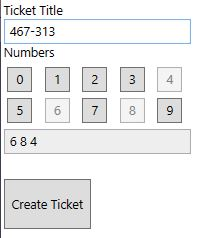
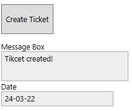
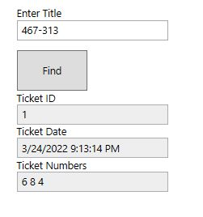
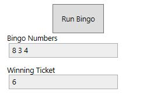

# Bingo application

## Architecture Layers

<pre>
<b>Domain<b/> 
  {project} classlib
  {project-references}
  {packages}
  
<b>Persistence<b/>
  {project} classlib
  {project-references} Domain Business
  {packages} MicrosoftEntityFrameworkCore  MicrosoftEntityFrameworkCore.Design MicrosoftEntityFrameworkCore.SqlServer 
   
<b>Bussines<b/>
  {project} classlib
  {project-references} Domain 
  {packages} MicrosoftEntityFrameworkCore
  
<b>UI<b/>
  {project} WPF
  {project-references} Domain Persistence Business
  {packages}
</pre>

## Database

Run docker container  
`docker compose -f .\scripts\sql-server.yml up`

Create Migration  
`dotnet ef Migrations add --project .\BingoApp.Persistence\ -- "Server=localhost,8000;Database=BingoAppDb;User Id=SA;Password=Secure123"`

Update Database  
`dotnet ef database update --project .\BingoApp.Persistence\ -- "Server=localhost,8000;Database=BingoAppDb;User Id=SA;Password=Secure123"`

## Bingo 

This is simple Bingo 3 out of 10

## **Create Ticket**

Add **Ticket Title** and select three numbers. 

Click on **Create Ticket** and wait for message response in dialog box

## **Look for your Ticket**

Type in your ticket **Title**

## **Play Bingo**

Click on button **Run Bingo** and find out your luck

